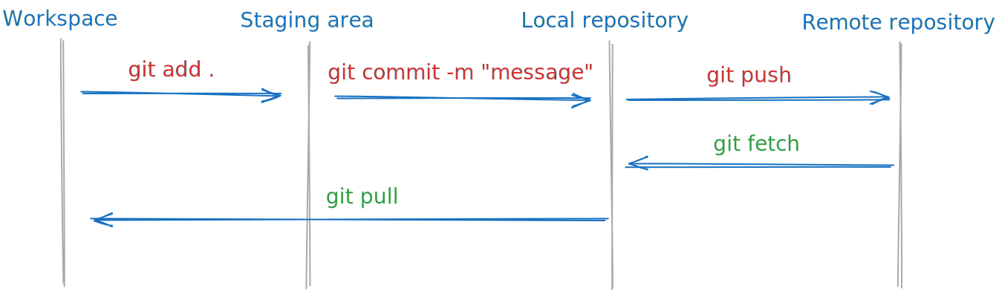
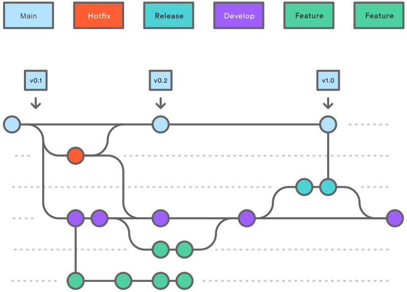

## Git basic Workflow

<p align="center">
  
  <p align="center">Fig.1 - Git basic Workflow</p>
</p>

---

## Git Commands

1.  Initialize git:

    ```bash
    git init
    ```

2.  Check remote repository:

    ```bash
    git remote
    git remote -v
    ```

3.  Connect to remote repository (optional):
    If remote repository is not connected use,

    ```bash
    git remote add origin http://185.100.212.76:7776/Vishnu/modeling_app.git
    ```

    To change url use,

    ```bash
    git remote set-url origin http://185.100.212.76:7776/Vishnu/modeling_app.git
    ```

4.  Fetch from origin:

    On fetch mention --all to pull all branches or mention remote_name and branch_name to fetch a particular branch.
    Use --force to perform force Pull.

    ```bash
    git fetch
    git pull
    ```

5.  Staging and Commit changes:

    - "." indicated all changed files will be staged.
    - For, specific file replace "." with the path to the specific file or directory(folder).
    - "commit message" - replace text in this phrase to your commit discription.

    **Staging**

    ```bash
    git add .
    git add path/to/directory_or_file
    ```

    To Unstage all files that were added to the staging area but does not affect the working directory:

    ```bash
    git reset
    ```

    **Commit**

    ```bash
    git commit -m "commit message"
    ```

    Creates a new commit that undoes the changes introduced by the specified commit, use --hard for discarding all changes since that commit (Warning: This command can permanently delete data.):

    ```bash
    git revert commit_hash
    ```

6.  Inspecting Commits:

    - View the commit history:

      ```bash
      git log
      ```

    - View a graph of commits:

      ```bash
      git log --graph --oneline --all
      ```

7.  Push to remote repository:

    - If the branch is creted for the first time and dose not located in the remote repsitory. Use,

    ```bash
    git push --set-upstream origin new_branch_name
    ```

    - Normal push

    ```bash
    git push origin new_branch_name
    ```

    - Force push and Safer force push

    ```bash
    git push --force
    git push --force-with-lease
    ```

    - Delete branch in remote repository

    ```bash
    git push origin --delete branch_name
    ```

8.  Creating and Switching Branches:

    - To check current branch name. Use,

    ```bash
    git remote
    ```

    - To checkout from current branch and move to another branch. Use,

    ```bash
    git checkout branch_name
    ```

    - To checkout from current branch and create new branch. Use,

    ```bash
    git checkout -b new_branch_name
    ```

9.  Merging branches:

    - Merges the specified branch to the current active branch:

    ```bash
    git merge branch_name
    ```

    - This will only perform the merge if it can be fast-forwarded. If a fast-forward isn't possible, Git will abort the merge:

    ```bash
    git merge --ff-only branch_name
    ```

    - Provide a custom merge commit message:

    ```bash
    git merge -m "Custom merge message" branch_name
    ```

    - Merge without committing automatically:

    ```bash
    git merge --no-commit branch_name
    ```

    - Continue the merge after resolving conflicts:

    ```bash
    git merge --continue
    ```

    - Abort a merge in progress:

    ```bash
    git merge --abort
    ```

10. Stash changes:

    - Stashes changes made in current branch:

    ```bash
    git stash
    ```

    - Stashes changes made in current branch with message:

    ```bash
    git stash save "message"
    ```

    - Apply Latest stash and apply and remove form stash list:

    ```bash
    git stash apply
    git stash pop
    ```

    - View Stash:

    ```bash
    git stash list
    ```

    - Clear all stashes:

    ```bash
    git stash clear
    ```

    - Remove the latest stash:

    ```bash
    git stash drop
    ```

11. Branch commands:

    - To View all local and remote branches

      ```bash
      git branch
      git branch -a
      ```

    - To Create branch

      ```bash
      git branch branch_name
      ```

    - To switch between branch

      ```bash
      git checkout branch_name
      ```

      Alternatively if you want to bring the changes to the new branch,

      ```bash
      git switch branch_name
      ```

    - To switch between branch

      ```bash
      git checkout -b branch_name
      ```

      Alternatively,

      ```bash
      git switch -c branch_name
      ```

    - To rename branch

      ```bash
      git branch -m old_branch_name new_branch_name
      ```

    - To Delete branch (use -D to force delete)

      ```bash
      git branch -d branch_name
      ```

12. Other git comments consiered usefull in previous encounters:

    - press q to exit git response

    - Prevent git from creating **zoneIdentifier** files

      ```bash
      git config core.protectNTFS false
      ```
---

## Git Branching

<p align="center">
  
  <p align="center">Fig.2 - Git Branching</p>
</p>

This diagram represents a branching model for managing the development of a software project. It uses different branches to organize and control how code changes are developed, tested, and released. Here’s a breakdown of the key concepts, simplified for someone new:

### **Main Components**
1. **Main Branch** (blue line):
   - This branch represents the "production" or "live" version of the project.
   - Only stable and tested versions of the code are added here.
   - Releases like `v0.1`, `v0.2`, and `v1.0` are tagged here.

2. **Develop Branch** (purple line):
   - This is where active development happens.
   - Features or fixes are integrated here before they are prepared for a release.
   - It acts as a staging area for new work to ensure it’s functional and complete.

3. **Feature Branches** (green lines):
   - These branches are used to develop specific features or tasks.
   - Developers create a new branch for each feature and work on it independently.
   - Once complete, they are merged into the **Develop Branch**.

4. **Release Branch** (teal line):
   - Before a release is finalized, a release branch is created.
   - Final fixes and testing are done here to ensure stability.
   - Once complete, it is merged into both **Main** and **Develop** branches to mark the release.

5. **Hotfix Branch** (red line):
   - This branch is for urgent fixes to the live code.
   - If an issue is found in the **Main Branch** (e.g., a bug in `v0.1`), a **Hotfix Branch** is created.
   - After fixing, it is merged into both **Main** and **Develop** to ensure the fix is applied everywhere.

### **Workflow Summary**
1. **Start a Feature:**
   - Create a feature branch from the **Develop Branch**.
   - Work on your task and complete it.

2. **Integrate Your Work:**
   - When your feature is ready, merge it back into the **Develop Branch**.

3. **Prepare a Release:**
   - When the team decides to release a version, a **Release Branch** is created from **Develop**.
   - Final adjustments are made before merging it into **Main**.

4. **Fix Urgent Problems:**
   - If a critical issue is found in production, create a **Hotfix Branch** from **Main**, fix it, and merge it into both **Main** and **Develop**.

This system helps keep work organized, ensures stability for the live version, and allows teams to work on different features or fixes simultaneously. It’s designed to make collaboration and code integration smoother.

---

## Aditional notes

**On start the app asks wheather to pull from git or not.**

- If you are connected to the remote repository, type "y" or "yes" to perform the pull action. The app will automatically abort the start process if the pull operation encounters any issues to prevent abnormalities.
- If you are not connected to the remote repository, type "n" or "no" to skip the pull action and proceed with starting the app.
